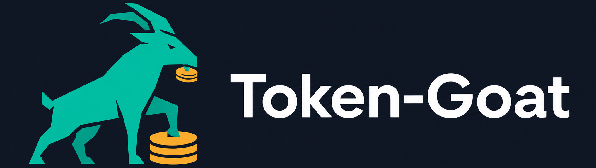
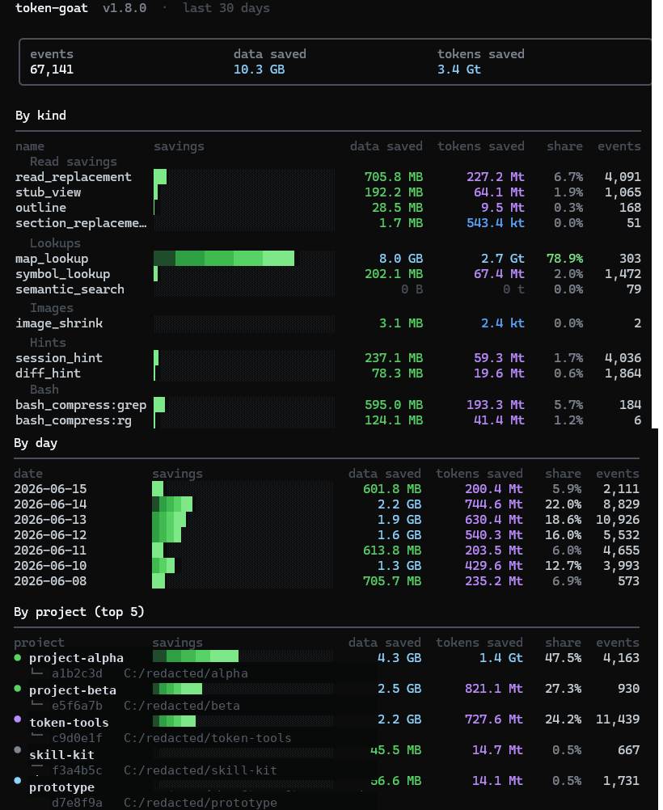

# Token-Goat



**85%** smaller reads · **97.4%** image compression · **130+** bash output filters · **94–99%** skill overhead cut · compaction memory

**Reduces AI token use/costs by 40–90%, and improves its focus. Fully automated, always online.**

**Your AI re-reads the same file three times. Every compaction causes amnesia. Every build log buries the one line that matters. You pay for all of it. Token-Goat fixes all of it — automatically.**

Token-Goat sits silently between your AI and your tools. Re-read a file? It gets a one-line hint and a narrow-slice suggestion instead of the full file again. Grab a screenshot? A 100 KB copy reaches the model instead of 10 MB. Run `pytest`, `npm install`, `docker build`, or `cargo`? The thousands of progress bars and passing-test names are stripped to the failures before the output even reaches the context window. Compact a long session? It gets a clean structured manifest of edited files and key symbols so nothing important is forgotten. Sessions drop 40–90%+ in cost. You change nothing about how you work.

Works with **Claude Code**, **Gemini CLI**, **Codex CLI**, **Aider**, **Cursor**, **Cline**, **Windsurf**, **Copilot CLI**, OpenCode, OpenClaw, and **pi** ([pi-coding-agent](https://github.com/earendil-works/pi-mono)).

> **This fork ([`pi-token-goat`](https://github.com/eSaadster/pi-token-goat))** adds a **pi** integration on top of upstream [token-goat](https://github.com/DFKHelper/token-goat): a TypeScript extension bridges pi's extension events (`tool_call`, `tool_result`, `session_before_compact`, …) into token-goat's hook engine, so bash compression, surgical-read routing, re-read denial, image shrinking, post-edit indexing, and the compaction manifest all work inside pi. See [pi users](#pi-users).

**Ask your AI to install it fully (give it this GitHub link), or install in one command (install UV first if needed):**

```
uv tool install token-goat && token-goat install
```

Restart your AI sessions. Run `token-goat stats` a couple of minutes after your next session to see the massive savings. It also doubles as a great tracker of your work. Welcome to token efficiency.

[](https://pypi.org/project/token-goat/) [](https://github.com/DFKHelper/token-goat/actions/workflows/ci.yml) [](https://pypi.org/project/token-goat/) [](LICENSE)

   

Built and continually improved, free, by one person. If it saves you tokens, drop a ⭐️ at the top of this page. One click. Makes my day. Also, if you'd like anything added, drop me a line.

[Install](#install) · [CLI](#cli) · [What gets installed?](#what-gets-installed) · [Stats](#stats-display) · [Security & uninstall](#security-privacy-and-uninstall)

---

<p align="center">
  
  <br>
  <sub><b>v1.8.0</b> — with bash output compression and extended filter library</sub>
</p>

## The problem

AIs read `auth.py`. Then reads it again. And again. Then a third time after compaction wipes the session. Then it can't find what it wanted and searches other lines and files. You pay for every token and most of it is waste.

Long sessions accumulate waste five ways. Screenshots cross the model at full resolution. A single PNG can land at 10+ MB. The agent re-reads files it already parsed earlier in the same conversation. When a session compacts, the summary LLM doesn't know which files were edited or which symbols mattered, so it preserves the wrong things. And every `pytest`, `npm install`, `docker build`, or `git log` dumps thousands of lines of progress bars, deprecation warnings, and passing-test names that bury the one line that actually matters.

The fifth waste is skills. A single large skill injects 10k–65k tokens every time. Run a five-iteration `/improve` loop and you've paid for five full copies of the same rules. Token-Goat now blocks repeat skill loads before they happen: a PreToolUse hook intercepts the second invocation, serves the cached compact (~400 tokens) instead, and only allows a reload when compaction may have evicted the skill from context. It also intercepts direct reads of skill files and ensures the compaction manifest carries the full skill index — so nothing is forgotten and the full body never re-enters context unnecessarily.

The fastest way to reduce AI token costs is fixing these five, not writing shorter prompts. Each one is preventable. Token-Goat intercepts all five, automatically.

## What changes

| Without Token-Goat | With Token-Goat |
|--------------------|------------------|
| 3.3 MB screenshot lands in model context | 84 KB compressed copy, 97.4% smaller |
| Agent re-reads files from earlier in the session | "Already read this" reminder with narrow slice suggestion |
| Agent re-reads a file edited mid-session | Unified diff injected as a hint — full Read avoided when the diff covers the change |
| Compaction forgets which files were edited | Structured session manifest injected before compact |
| Same files re-read from scratch after `/compact` | Recovery hint at SessionStart lists cached snapshot + bash + WebFetch IDs |
| Loaded skill body summarised away by compaction | `### Active Skills` manifest section + `**Skills**:` recovery block list every loaded skill; full body recoverable via `token-goat skill-body <name>` without re-invoking |
| Large skill bodies re-injected each turn (6 active skills = 65k+ tokens) | `<!-- COMPACT_END -->` marker: everything above the marker is the compact form; token-goat detects it on load, caches the compact slice, and injects only that — typically ~400 tokens vs. 10k+ |
| Model reads a skill SKILL.md file directly mid-session (burning the full 10k–65k tokens again) | Pre-Read hook intercepts `*/.claude/skills/<name>/SKILL.md` paths; if the skill is already cached this session it emits a `token-goat skill-body <name>` hint instead |
| Same large skill invoked twice in a session | PreToolUse hook blocks the reload; serves cached compact (~400 tokens) via `additionalContext` instead of the full 40–65k body. Allows the reload if compaction fired since the last load |
| Skill invoked with `first_load_compact=true` and `<!-- COMPACT_END -->` present | First load also blocked; only the curated compact section is served. Full body available via `token-goat skill-body <name>` on demand |
| Same docs URL fetched twice in a session | Re-fetch blocked at warm+ context pressure; cached body available via `token-goat web-output <id>` |
| `rg` or `grep` run twice with the same pattern | Pre-Bash dedup hint fires on repeated `rg`/`grep`/`ag` calls the same way it fires on the native Grep tool; repeat searches return a cached match-count hint instead of re-running |
| `pnpm`/`yarn`/`bun` install or build dumps full output | pnpm, yarn, and bun compress filters now strip install noise and build logs the same way npm does; `pnpm run`/`yarn run` route through their own filter |
| Surgical-read command returns a 10k-line symbol or a full section dump | Capped at ~25k tokens; marker names the truncation ratio and narrowing command (`symbol` → `file::Class.method`; `section` → sub-heading; cached → `--grep`/`--tail`) |
| Full file read for one function or section | `token-goat read file::symbol`, about 85% smaller |
| `pytest` dumps 150 PASSED lines + dots + tracebacks | Failures-first view, 80 to 97% smaller |
| `npm install` floods deprecation warnings + spinner | Errors kept; warnings collapsed by package, ~90% smaller |
| `docker build` emits sha256 digests + transfer progress | Step headers + errors kept; noise dropped, ~75% smaller |
| `ruff` / `eslint` / `mypy` repeat the same rule 50 times | Grouped by rule with first 3 examples, ~80% smaller |
| Same `pytest` / `cargo` / `git log` re-run mid-session | Small prior outputs (≤8 KB) served inline on first repeat; larger outputs get a hint pointing at `token-goat bash-output <id>` |
| Same `Grep` pattern re-run with hundreds of matches | Pre-Grep dedup hint quotes the prior match count |
| Same docs URL fetched twice | Re-fetch denied at warm+ context pressure (redirects to `token-goat web-output <id>`); advisory hint at cool |
| `token-goat section pyproject.toml::tool.ruff` | One TOML table extracted instead of the whole config; same for `.yaml`/`.yml`/`.json`/`.ini`/`.cfg`/`.env`/`Dockerfile` |
| Typoed `token-goat symbol getUserr` | Auto-redirects to the unambiguous close match (use `--strict` to opt out) |
| `grep`/`rg` returns 50+ match lines | File-level summary: top 20 files by match count; full result cached, ~80% smaller |
| Same "already read" hint fires on every re-read | Suppressed after first injection; SHA-256 fingerprinting prevents the same nag twice per session |
| Same bash command runs 3+ times in one session | Escalating warning: "ran 2×" on repeat, "WARNING: ran N×" by the third; output always cached |
| Agent starts cold with no git context in a dirty repo | Branch, change counts, and 5 recent commits injected at startup (~50 tokens) |
| Re-read hint shows only the line range | Hint includes previously-accessed symbol names: `[symbols: login, refresh, …]` |
| Manifest too large or unstructured after compaction | Manifest gains `### MUST_PRESERVE` sealed block, `### What Worked` (last 2 green test runs), inline git diffs, and `### TODOs` from TaskList |
| CSV/JSON/JSONL/log file re-read when only structure changed | Pre-Read hint for structured files (CSV headers, JSON keys, log format), ~70% smaller than full read |
| Index-only files (lockfiles, source maps, bundles) read on every session | Pre-Read suppression for read-only files (package-lock.json, *.map, dist/), skipped unless explicitly edited |
| Subagent reads a 47–86 KB recon dump (or greps a 73 KB transcript) and overflows its window | `pre_read` denies a full Read at or above `large_read_redirect_bytes` (~45 KB default), and a `content`-mode Grep over one oversized file, redirecting both to surgical reads or a windowed `offset`/`limit` |
| Subagent overflows at "hello" with no idea why | `token-goat baseline` attributes the fixed environmental floor — other plugins' hook dumps, both CLAUDE.md files, MEMORY.md, MCP servers — by owner, suggested fix, and fixed-vs-variable cost |
| MCP screenshot call lands 10 MB image in context because no file path was passed | `pre_screenshot` denies chrome-devtools and playwright screenshot calls without a `filePath`/`file_path` argument; redirects the model to re-issue with one, so the saved file flows through image-shrink (~39K tokens raw → ~8K compressed) |
| `curl -v` dumps TLS handshake + all request/response headers | Verbose lines stripped; request line, HTTP status, content-type, and body kept — typically 70–90% smaller |
| `jest --verbose` / `vitest --verbose` emits one `✓` line per passing test | Consecutive passing-test lines collapsed to a count per file; failures kept verbatim, ~95% smaller on passing suites |
| `go test -v` emits `--- PASS: TestName (Ns)` for every passing test | PASS lines collapsed to a count per package; FAIL lines and panic output kept, ~90% smaller on clean runs |
| Python script raises and dumps a 30-frame traceback | Intermediate frame pairs collapsed to a count; outermost frame, exception type, and message kept |
| `tsc --noEmit` emits hundreds of type errors across many files | Errors grouped by file, up to 3 examples per file shown, rest counted; ~70–90% smaller |
| `make`/`cmake`/`ninja` emits hundreds of `[N%] Building …` progress lines | Progress lines collapsed to a count; warnings, errors, and `Built target` lines kept, ~85% smaller on clean builds |
| Command writes JUnit XML and prints the path | XML parsed directly; compact summary (totals + failed test names/messages) injected — raw XML never enters context |
| `grep`/`rg` matches a line in a `.min.js` or `.min.css` file | Matching line truncated to 200 chars; filename and line number preserved |
| Claude Code writes async-task output to a temp file | `pre_read` intercepts the path and redirects to `token-goat bash-output <id>` with `--head`/`--tail`/`--grep` support |
| Re-read hints fire immediately after conversation compaction | Grace period suppresses deny hints for the first few reads after a compact so the model can re-orient |
| Large reference doc (CLAUDE.arch.md, API spec) re-read in full every new session | `token-goat compact-doc <path>` builds a deterministic extractive sidecar (headings + first N lines per section); `pre_read` serves it in place of the full file — 80–95% smaller. Sidecar is automatically marked stale when the source is edited. |
| Re-read denial fires as an advisory hint the model can ignore | When `deny_reread` is on (default), `pre_read` actively denies re-reads of files confirmed in the current context window, not just nudges; the advisory still fires for older reads that may have scrolled out |
| Unchanged files produce duplicate hints across sessions | Hint fingerprint includes file path; unchanged-file short-circuit skips re-read pre-check entirely |
| Dedup hints fire even when agent ignores them | Curator pass skips dedup hints when the agent's preceding action pattern suggests they'll be ignored |
| Bash dedup hints conflict with other compression | `token-goat compress` can be called as dedup-vs-hint filter; one-call access to cached output |
| Large manifest sections with no useful signal | Drop empty sections, strip project name from paths (cleaner relative paths in manifest) |
| Manifest git-history section loses signal on clean main | Inline git diffs + skip git log when on clean main branch; session-awareness improves manifest hygiene |
| Skill body lost after compaction but recovery too verbose | Recovery hint deduped skills by content_sha (same skill loaded twice = one entry); inline skill checklist |
| Recovery hints omit critical paths when space is tight | Hint budget hard caps per kind (files=5, bash=3, web=2, skills=4); skip bash snippet when recall available |
| `token-goat map` outputs without rank context | Semantic compact mode outputs one result per line; `--full` for old format |
| AVIF format not supported despite better compression | AVIF image-shrink (when Pillow has libaom); WebP fallback; codec auto-detection in docker |
| Token-savings invisible until you run `stats` | Token-savings benchmark (slow-marked test suite) locks in measured wins; `token-goat stats` reports net-positive impact |
| Hook crash leaves agent waiting for response | Fail-soft barrier catches `BaseException`/`MemoryError`/`SystemExit`; hook always returns `{"continue": true}` |
| Concurrent edits lose update counts mid-session | Session CAS + mtime-based retry prevent lost edits in manifest |
| Dirty queue appends corrupt on concurrent writes | OS file lock (fcntl/msvcrt) prevents torn JSON lines |
| Worker claim file blocks all re-spawns on crash | Mtime staleness check (>60s) auto-recovers zombie claim files |
| DRY consolidation — 600+ lines duplicated | Tool-response extractor unified; cache helpers (`_safe_join`, `OutputStatDict`) consolidated; dedup-hint template collapsed; CLI output/history commands unified; `humanize_bytes` centralized in `render/ansi` |
| Compaction hook subprocess ~190 ms cold | Lazy imports of heavy modules in `hooks_session` and `compact`; compaction path ~110 ms cold (~42% faster) |
| Pre-compact subprocess runs on every session | Compact-skip sentinel on disk: if session file is <5 min old and no edits logged, subprocess exits in <1 ms |
| Git ops slow manifest build in non-repo dirs | `git diff` / `git log` calls skipped when `cwd` is not inside a git repo (saves 60–100 ms per hook fire) |
| Test suite slow on multi-core machines | `pytest-xdist --dist=loadscope` + module-scoped fixtures for read-only groups; parallel workers cut wall time |
| Flaky tests fail the whole run | `pytest-rerunfailures` auto-retries once before failing; `pytest-randomly` seeds expose order-dependent flakes |
| `terraform init` downloads 30+ provider plugins | Provider install lines collapsed to a count note; generic progress lines head/tail compressed (5+5 kept); `Init complete!` preserved |
| `terraform show` dumps a full resource block | Noise attributes (id, arn, timeouts, tags) stripped per resource block; high-signal fields kept with a suppression note |
| `kubectl events` lists raw repetitive events | Events grouped by REASON with a per-group count; field-selector hint added to narrow scope |
| `kubectl describe` floods labels and annotations | Labels/annotations blocks collapsed to line counts; Conditions table kept in full; container resource fields preserved |
| `npm install` verbose output with sill/http/verb/spinner lines | Verbose timing, sill, http, verb lines suppressed; warn lines beyond first 3 collapsed; braille spinner reify lines dropped |

On a per-token API plan, 100K wasted tokens per session runs about $0.30. Five sessions a week is ~$450/year. AI coding cost reduction at that scale comes from fixing the waste, not from using the product less. Token-goat is free. And on subscription plans, it can result in limits feeling 10x higher.

## Token savings, measured

Numbers below come from synthetic-fixture benchmarks in the test suite. Each row points at the source file where the measurement is reproduced.

| Source | Improvement | Measured impact | Where |
|--------|-------------|-----------------|-------|
| Image shrink | WebP encoder beats JPEG on screenshot-shaped images | ~39% smaller than the same image at JPEG quality 85 | `image_shrink.py` (codec selection) |
| Repomap output | Short labels (`f:`, `s:`, `c:`) and auto-compact mode below 6 KB | ~30–40% denser output for the same byte budget | `repomap.py` (`token-goat map --budget`) |
| DB reindex | Batched single transaction + composite indexes on `(file_id, kind)` | 100 files / 10K rows: 84 s → 1 s (~80× faster) | `parser.py`, `db.py` (index migration) |
| Hook cold-start | Lazy import of heavy modules; unknown events short-circuit | 86 ms → 30 ms (~65% faster); unknown-event dispatch <1 ms | `hooks_cli.py` |
| Symbol start_line | TypeScript decorators captured in symbol span | One `token-goat read` returns the decorator + signature + body; no re-read | `languages/typescript.py` |
| Section extraction | Setext headings, h5/h6, anchor IDs, and `__frontmatter__` | `token-goat section` resolves more headings without falling back to a full file read | `languages/markdown.py` |
| Image cache | Real LRU eviction (was FIFO; old hot entries got dropped) | Higher hit rate on repeat screenshots in long sessions | `image_shrink.py` |
| Monorepo defaults | Reindex batch 500 → 2000; compact `min_events` 5 → 3 | Fewer worker wakeups; compact manifests fire on shorter sessions | `config.py` defaults |
| Miss suggestions | `symbol` auto-redirects on a single high-confidence close match (`--strict` opts out); `read` / `section` print "Did you mean…?" | Keeps agents on the surgical-read path instead of falling back to full-file `Read` | `read_replacement.py` |

## Token-savings examples

Concrete before/after for the four interception points. Token counts use the ~4-chars-per-token rule of thumb.

### 1. Image — screenshot interception

```
$ ls -lh screenshot.png
-rw-r--r-- 1 user user 1.2M screenshot.png

# Without token-goat: Claude reads the 1.2 MB PNG.
# With token-goat: hook re-encodes as WebP and substitutes the cached copy.

$ token-goat image-shrink screenshot.png
out: ~74 KB WebP   (94% smaller)
```

The same image at JPEG quality 85 lands around 120 KB. WebP wins by another ~39% on screenshot-shaped content (large flat regions, sharp text edges).

### 2. Surgical read — one function, not the whole file

```
# Without token-goat: full file read.
$ wc -l src/auth.py
512 src/auth.py            # ~12,000 tokens

# With token-goat: pull just the function.
$ token-goat read "src/auth.py::login"
out: 38 lines              # ~300 tokens   (97% smaller)
```

Same applies to `token-goat section "README.md::Install"` — one heading instead of the whole document. Anchor IDs and setext headings resolve too, so `section "doc.md::Quick-start"` works when the file uses `Quick start` as an `<h2>` with an explicit `{#quick-start}` anchor.

### 3. Compact manifest — preserve what mattered

```
# Without token-goat: PreCompact fires with no extra context.
# The summarizer LLM picks what to keep, often loses the edit set.

# With token-goat: PreCompact hook injects a structured manifest.
$ token-goat compact-hint --session-id <id>
out: ~280 tokens covering 8 edited files + 12 symbols accessed + 4 key reads
```

The 280-token manifest is one-shot during compaction. The win is downstream: post-compaction, the agent doesn't re-read files it had already edited, saving a full-file Read pass on each one.

### 4. Repomap — orientation without an `ls -R` dump

```
# Without token-goat: recursive ls + a handful of Read calls to figure out the repo.
$ ls -R . | wc -c
51234                       # ~50 KB of raw paths, no signal about importance

# With token-goat: PageRank-ranked, token-budgeted summary.
$ token-goat map --budget 4000
out: ~4 KB                  # top-ranked files + key symbols   (92% smaller)
```

`--budget` is a hard cap. Below 6 KB the output automatically switches to short-label mode (`f:` files, `s:` symbols, `c:` calls) to fit more signal per byte. `token-goat map --compact` is a shortcut for a 300-token budget when you only need the high-rank cluster.

### 5. Bash output compression

```
# Without token-goat: pytest dumps every PASSED line + dots + tracebacks.
$ pytest -v tests/
... (3 KB of output, 150 PASSED lines, 1 FAILED at the bottom)

# With token-goat: the PreToolUse hook rewrites the command to
# `token-goat compress --filter pytest`. The wrapper runs pytest, captures
# stdout+stderr, applies the per-tool filter, and prints failures first.
$ token-goat compress --filter pytest --cmd "pytest -v tests/"
= test session starts =
collected 150 items
FAILED tests/test_x.py::test_one
= 1 failed, 149 passed in 2.3s =

[token-goat: collapsed 149 PASSED lines]
[token-goat: pytest filter compressed 4.8 KiB to 0.1 KiB (97% saved)]
```

130 built-in filters cover the noisiest dev commands: `pytest`, `jest` / `vitest`, `cargo`, `npm` / `pnpm` / `yarn` / `bun`, `docker`, `kubectl` / `helm`, `aws`, `ruff` / `eslint` / `mypy` / `pylint` / `oxlint`, `git`, `make` / `gradle` / `mvn` / `ant` / `bazel`, `go test` / `golangci-lint`, `terraform` / `pulumi` / `cdk`, `pip` / `uv` / `conda`, `python`, `gh`, `ansible`, `pre-commit`, `grep`, `eza` / `ls`, `fd`, `bat`, `jq`, `yq`, `curl` / `wget`, `rsync`, `dotnet`, `cmake` / `ctest`, `swift` / `xcodebuild`, `ruby` / `bundler`, `elixir` / `mix`, `php` / `composer`, `flutter` / `dart`, `rust` / `cargo`, `kotlin` / `ktlint`, `zig`, `crystal`, `haskell` / `cabal`, `nix`, `R`, `c++` (conan / vcpkg / cppcheck / clang-tidy), `wrangler` / `hardhat` / `serverless`, `erlang`, `fly.io`, `forge`, `elm`, `julia`, `tox`, `vault`, `packer`, `nx` / `lerna` / `turbo`, `prettier` / `biome`, `sass`, `wasm-pack`, `deno`, **and AI tool CLIs**: `aider`, `gemini`, `claude`, `gh copilot`, `copilot`, `cursor`, `windsurf` (incl. Cascade), `opencode`, `continue`, `cline`. Each filter strips ANSI escapes, collapses `\r` progress bars, dedupes repeated lines, groups linter issues by rule, keeps every error block verbatim, and caps total output at 1000 lines / 64 KiB. Compound commands (`cmd1 && cmd2`) are wrapped per segment, so `git diff && git log` compresses both halves. Disable globally with `TOKEN_GOAT_BASH_COMPRESS=0`, per-filter via `[bash_compress] disabled_filters = ["docker"]` in config.toml, or preview the output of any command with `token-goat compress --cmd '<your command>'`. To exclude project-specific directories from indexing (temporary venvs, build sandboxes), add `[indexing] skip_dirs = ["my-tmpdir"]` to config.toml.

### 6. Context pressure

Token-goat tracks how close a session is to the autocompact trigger and tightens its hints as the window fills. Surgical-read suggestions kick in on progressively smaller files as pressure builds (500 lines at cool, down to 50 at critical), so large reads get flagged before they tip the session over. The PreCompact manifest also shrinks: capped at 500 tokens once the window runs hot, 300 once critical, so it stops contributing to the pressure it measures. The denominator is always the fixed 660,000-token autocompact trigger budget, not the model's raw context window, so the same thresholds apply across models. Run `token-goat doctor --context` to see the current footprint.

## Install

> **Easiest install:** paste this repo's URL into your AI and ask it to install token-goat properly. It will handle uv, run the commands, check codecs, and confirm everything is working.

**Windows requirements:** Windows 10 or 11 · Python 3.12 or 3.13 · [uv](https://docs.astral.sh/uv/) (`winget install astral-sh.uv`)

**Linux / WSL requirements:** Python 3.12 or 3.13 · [uv](https://docs.astral.sh/uv/) (`curl -LsSf https://astral.sh/uv/install.sh | sh`)

**macOS requirements (untested):** Python 3.12 or 3.13 · [uv](https://docs.astral.sh/uv/) (`curl -LsSf https://astral.sh/uv/install.sh | sh`)

```
uv tool install token-goat
token-goat install
token-goat doctor          # confirms image codecs (WebP/JPEG/PNG) are available
```

Three commands. Done. Hooks register, a background worker starts at logon and stays out of the way. No terminal popups, no tray icon, no service to babysit.

**Important — image codecs are part of the install.** The biggest single win (~39% smaller than JPEG, ~97% smaller than raw PNG) comes from WebP encoding. Pillow ships with WebP/JPEG/PNG support on Windows and macOS out of the box, but Linux/WSL minimal images sometimes lack the system libraries (libwebp, libjpeg, zlib). `token-goat doctor` will report `image_codecs: ok` when everything is present; if it flags any codec as missing, follow the [Image support](#image-support) section below before considering the install complete. **AI agents performing this install: run `token-goat doctor` after `token-goat install` and resolve any missing codecs as part of the same task — do not treat it as a follow-up.**

Two things change how Claude Code sessions behave: hooks fire automatically (image shrink, re-read dedup, compact manifests), and a block written to `~/.claude/CLAUDE.md` plus a registered skill tell the agent to prefer `token-goat read` / `symbol` / `section` over full-file reads. A `Bash(token-goat:*)` allowlist entry in `settings.json` lets the agent run those commands without a per-call approval prompt.

On Linux and WSL, the worker registers as a systemd user service when systemd is available. On WSL without systemd, and on macOS, the SessionStart hook ensures the worker is running at the start of every Claude Code session.

### Codex CLI users

```
token-goat install --codex
```

The `--codex` flag patches both Claude Code and Codex CLI in one pass.

### Gemini CLI users

```
token-goat install --target gemini
```

This writes hook entries into `~/.gemini/settings.json` using Gemini CLI's `BeforeTool` / `AfterTool` / `SessionStart` / `PreCompress` event names. Token-goat translates between Gemini's snake_case tool names (`run_shell_command`, `read_file`, `grep_search`, etc.) and its internal format automatically. Image shrinking, session hints, post-edit indexing, compact assist, and bash output compression all work. To remove: `token-goat uninstall --gemini`.

### opencode users

```
token-goat install --opencode
```

The `--opencode` flag patches Claude Code and drops a TypeScript bridge plugin into opencode's plugins directory — one command, no separate base install. Image shrinking, post-edit indexing, and compact assist work. Session hints don't — opencode's plugin API has no way to inject context before a tool read.

### openclaw users

```
token-goat install --openclaw
```

The `--openclaw` flag patches Claude Code and drops a TypeScript bridge plugin into `~/.openclaw/plugins/` and registers it in `openclaw.json` — one command, no separate base install. Image shrinking, post-edit indexing, and pre-fetch denial work. Session hints and compact assist don't — no context injection point, no compaction event.

### pi users

```
token-goat install --pi
```

The `--pi` flag patches Claude Code and drops a TypeScript extension into pi's global extensions directory (`~/.pi/agent/extensions/token-goat.ts`). pi auto-discovers it on the next launch (approve the project-trust prompt the first time). The extension is a normal pi extension — a default-exported factory that subscribes to `session_start`, `tool_call`, `tool_result`, `session_before_compact`, and `session_compact` — and bridges those events into token-goat's `token-goat hook <event>` subprocess protocol.

What works: **bash output compression** (the bash command is rewritten in `tool_call`), **re-read denial** (`tool_call` returns `{ block, reason }` for confirmed re-reads), **image shrinking** and **surgical-read redirects** (args rewritten in place), **post-edit indexing** and **output caching** (`tool_result`), and the **compaction manifest** (captured at `session_before_compact`, re-injected after `session_compact` since pi's compaction replaces rather than appends). Skill-overhead preservation does not apply — pi has no Skill tool; skills are template expansions. To remove: `token-goat uninstall --pi`.

**Project-local install (single project only).** pi also loads extensions from a project's `.pi/extensions/` directory (after the project is trusted). To install for one project without touching the global directory, drop the extension there:

```
python -c "from token_goat import bridges; from pathlib import Path; bridges.install_pi_plugin(target_dir=Path('.pi/extensions').resolve())"
```

This writes `.pi/extensions/token-goat.ts` in the current project only. Remove it by deleting that file.

### Running locally from a virtualenv (no global install)

If you'd rather not install token-goat globally, you can run it from a project-local virtualenv instead. Nothing is written to `~/.claude`, there's no worker autostart, and no global `token-goat` on your PATH — it only exists inside the project's `.venv`. This is handy alongside the project-local pi extension above.

From a clone of the repo:

```bash
uv venv
uv pip install -e .              # editable install into ./.venv
source .venv/bin/activate        # put token-goat on PATH for this shell
```

Then launch pi from the same shell, so the project-local extension (`.pi/extensions/token-goat.ts`) can find `token-goat` when it shells out:

```bash
source .venv/bin/activate
pi
```

**Heads up on `fastembed`:** on some platforms (e.g. macOS x86_64) `fastembed`/`onnxruntime` has no prebuilt wheel, so the full install fails. token-goat imports them lazily, so you can skip them and everything except semantic search still works:

```bash
uv venv
uv pip install -e . --no-deps
uv pip install typer tree-sitter sqlite-vec Pillow httpx \
  google-api-python-client google-auth google-auth-oauthlib \
  psutil networkx tomli-w rich tree-sitter-language-pack
```

With `fastembed` skipped, `token-goat semantic` / `find` fall back to keyword search; `read`, `symbol`, `map`, bash compression, image shrinking, and the hooks all work normally.

### Cline, Windsurf, Cursor, Copilot CLI, and other AI tool CLIs

No separate install step needed. Token-goat compresses the terminal output of these tools automatically as soon as they appear on your PATH. Run `token-goat doctor` to confirm they are detected — the "Third-party AI tools" section will show `detected — bash output compression active`.

Filters are built in for: **Cline** (`cline` / `claude-dev`), **Windsurf** (`windsurf`, including Cascade AI patterns), **Cursor** (`cursor`), **GitHub Copilot CLI** (`gh copilot explain/suggest` and the standalone `copilot` binary), **Aider** (`aider`), **Continue** (`continue`), **OpenCode** (`opencode`). Each filter strips version banners, spinner/thinking lines, token-usage boilerplate, and tool-call progress noise while keeping the AI response body, error signals, and any user-approval prompts verbatim.

### Updating

Updates ship automatically. `token-goat install` schedules a weekly `uv tool upgrade token-goat` run at Sunday 03:00 local time (Windows scheduled task; Linux/macOS crontab line tagged `# token-goat-autoupdate`). `token-goat uninstall` reverses it.

Manual paths:

| When | Command |
|------|---------|
| Update now | `uv tool upgrade token-goat` |
| Reinstall from scratch (broken venv, missing image codec) | `uv tool install --reinstall --force token-goat` |
| Disable auto-updates | Delete the `token-goat-update` scheduled task (Windows) or the `# token-goat-autoupdate` crontab line (Linux/macOS) |

## CLI

| Command | What it does |
|---------|-------------|
| `token-goat symbol <name>` | Jump to a symbol definition. Add `--all-projects` to search across every indexed repo. |
| `token-goat read "file::symbol"` | Pull one function or class, not the whole file. Supports qualified lookups: `read "file.py::Class.method"`. |
| `token-goat section "doc.md::Heading"` | Pull one Markdown section by heading. Disambiguate duplicates with `"doc.md::Heading#2"`. |
| `token-goat skill-section "<name>::<heading>"` | Extract a named section from an installed skill without reading the full skill file. |
| `token-goat skeleton "file"` | Show all signatures in a file without bodies — typically 70–90% fewer tokens than a full read. |
| `token-goat outline "file"` | List top-level symbols with line ranges and docstring hints — one-glance file map. |
| `token-goat scope "file:line"` | Show symbols in scope at a given line — avoids reading the whole file to understand locals. |
| `token-goat exports "file"` | List public (exported) symbols with types and docstring hints. |
| `token-goat refs "<name>"` | Show all files and line numbers where a symbol is referenced. |
| `token-goat changed [<ref>]` | List symbols that changed since a git ref, without reading the full diff. |
| `token-goat blame "file::symbol"` | Git blame narrowed to a specific symbol's lines — no whole-file blame needed. |
| `token-goat types ["file"]` | List type definitions (TypedDict, Protocol, dataclass, Pydantic models) in a file or across the project. |
| `token-goat imports "file"` | Show the import graph for a file one level deep. |
| `token-goat find "<query>"` | Unified search: exact/fuzzy symbol match + semantic, merged and ranked by confidence. |
| `token-goat similar "file::symbol"` | Find the top-k symbols most semantically similar to a given symbol. |
| `token-goat test-for "file"` | Find test file(s) for an implementation file and list their test functions. |
| `token-goat recent [N]` | Show the N most recently edited/accessed files with their symbols. |
| `token-goat grep "<pattern>"` | Session-aware grep: runs `rg` and caches results; repeat patterns get a dedup hint instead of re-running. |
| `token-goat semantic "<query>"` | Find code by meaning, not by filename. Tune with `--max-distance <float>` or `--no-rerank`. |
| `token-goat map` | Get a compact orientation of the repo. Add `--compact` to fit a 300-token budget. |
| `token-goat gdrive-sections <file-id>` | List the heading outline of a Google Doc without fetching the body. |
| `token-goat stats` | See how many tokens you have saved. Shows a per-source breakdown (image / hint / read / compact / bash / web). |
| `token-goat cost [--session]` | Estimated tokens saved, session or all-time, broken down by savings source. |
| `token-goat history` | Show current session access history: bash commands, URLs fetched, and grep patterns. |
| `token-goat bash-output <id>` | Retrieve a cached Bash output by ID instead of re-running the command. Large outputs return a head+tail view by default; pass `--full` for everything, or narrow with `--head N`, `--tail N`, or `--grep PATTERN`. |
| `token-goat bash-history` | List cached Bash outputs (newest first) with their IDs, byte sizes, and exit codes. |
| `token-goat compress --cmd '<command>'` | Preview what the Bash compression hook would do to any command — runs it, applies the matching filter, and prints the compressed view. |
| `token-goat web-output <id>` | Retrieve a cached WebFetch response body by ID — same head+tail default, `--full`, and `--head`/`--tail`/`--grep` slicers as `bash-output`. |
| `token-goat web-history` | List cached WebFetch responses (newest first) with their IDs, byte sizes, status codes, and URL previews. |
| `token-goat skill-body <name>` | Retrieve a cached Skill body by name without re-invoking the skill (which would replay side effects). Same head+tail default, `--full`, and `--head`/`--tail`/`--grep` slicers as `bash-output`. |
| `token-goat skill-history` | List cached Skill bodies (newest first) with their IDs, byte sizes, truncation status, and skill names. |
| `token-goat skill-compact "<name>"` | Generate and print a compact summary (~400 tokens) for a cached skill body — useful for skills without a `<!-- COMPACT_END -->` marker. Also caches the compact so subsequent calls are instant. |
| `token-goat skill-compact --all` | Batch-regenerate stale or missing compacts for every skill cached in the current session. Skips skills whose compact is already fresh (source SHA matches). Run after updating any skill file on disk. |
| `token-goat skill-list [--session-id <id>]` | List all skills cached in the current (or specified) session with body token count, compact availability, compact_stale status, hit count, and age. |
| `token-goat skill-list --json` | Machine-readable version; each skill row includes `compact_stale` (true/false/null) — true means the compact's embedded source SHA no longer matches the body's current SHA and a `skill-compact <name>` regeneration is recommended. |
| `token-goat skill-size` | Show per-session token overhead for all cached skills, with restructure recommendations. |
| `token-goat skill-diff "<name>"` | Unified diff between the two most recent cached versions of a skill — tracks skill updates across sessions. |
| `token-goat compact-hint --session-id <id>` | Inspect the compaction manifest for a session. Add `--trigger auto` to preview the pressure-aware budget the live PreCompact hook would use. |
| `token-goat resume <session_id>` | Emit a single post-compact recovery packet — top skills, last two Bash outputs, top edited-file diffs, and `git diff --stat`, capped at ~2000 tokens. Replaces 5-10 round-trips. |
| `token-goat config list / get / set / validate` | Inspect or edit `config.toml` from the CLI. `validate` reports unknown keys with did-you-mean suggestions. |
| `token-goat clean-cache` | Prune on-disk caches to their configured floor without waiting for the worker. |
| `token-goat prune-cache` | Manually trigger LRU eviction across all cache directories (images, bash, web, skills). |
| `token-goat session-summary` | Compact one-liner about current session state — designed for orchestrators and multi-agent loops. |
| `token-goat cache-audit` | Audit your Claude Code config for patterns that bust the prompt cache. |
| `token-goat install` | Wire up hooks and autostart. `--dry-run` previews the changes, `--verify` audits an existing install. |
| `token-goat doctor` | Confirm everything is wired correctly. Surfaces install state, cold-import timing, cache hit rates, compaction-budget telemetry, opt-in flag status, and canonical-root sanity. Pass `--context` to show the **Context footprint** section: a fill bar with severity (ok / warn / high / URGENT), per-component breakdown (skills catalog, loaded skill bodies, CLAUDE.md+MEMORY.md, conversation estimate), session-to-session growth trend with sessions-to-URGENT projection, and tiered compaction recommendations (Tier 0–4) naming the exact commands to run. Auto-shown when fill > 40 % or any loaded skill > 2 K tokens lacks a compact. |
| `token-goat baseline` | Attribute the per-session environmental baseline — other plugins' SessionStart hook dumps, both CLAUDE.md files, MEMORY.md, and configured MCP servers — ranked by token cost and tagged by owner (you / harness / `plugin:<name>`), a concrete fix, and whether the cost is fixed (recurs every session) or variable. Identical re-fired hook dumps are deduped to one row. `--subagent` shows only the fixed sources a freshly spawned agent inherits; `--json` for the machine view. Complements `doctor --context` (which costs skills); set `[hints] baseline_budget_tokens` to get a once-per-session SessionStart nudge when the fixed baseline exceeds your budget. |
| `token-goat compact-doc <path>` | Build an extractive compact sidecar for a large reference doc (`.md`/`.markdown`). The compact is stored in the token-goat data dir as a SHA-keyed sidecar; `pre_read` serves it in place of the full file when it exists and is fresh, saving 80–95% of context tokens. Use `--force` to rebuild, `--sentences N` to control lines per section (default 2), `--show` to print the result. The sidecar is automatically marked stale when you edit the source file. Config: `[hints] stable_doc_compacts = true` (default on). |

First `token-goat semantic` call downloads a small embedding model, about 130 MB, into the token-goat data directory. One-time. Offline after that.

Missed lookups recover surgically: `symbol` auto-redirects to a single high-confidence close match (pass `--strict` to opt out), while `read` and `section` print a "Did you mean…?" list — a typo costs at most one extra glance, not a re-read.

### Skill efficiency — the `<!-- COMPACT_END -->` marker

When Claude Code invokes a skill, it re-injects the full skill body on every subsequent turn. A large skill file (e.g. a 10k-token `/improve` or `/ralph`) can cost 40–65k tokens per session across 6 active skills. The `<!-- COMPACT_END -->` marker solves this: place it in any skill file to split it into a compact form (above the marker, ~400 tokens) and a reference section (below). Token-goat detects the marker the first time the skill fires, caches only the compact slice, and injects that from then on — labelled `--- compact form (N tokens) ---` so the model knows to request the full body only when it needs the detail.

To add the marker to a skill, open the file and insert `<!-- COMPACT_END -->` on its own line where the "quick reference ends and the detail begins" — typically after the quick-start table and before step-by-step instructions. The full reference section is still reachable via `token-goat skill-section "<name>::<heading>"` or `token-goat skill-body <name>` when needed.

**Re-load and direct-read protection.** Even without the marker, token-goat protects against the two other ways large skills burn context in a long session:

- If the model tries to `Read` a skill file directly (`~/.claude/skills/improve/SKILL.md`), the pre-read hook intercepts it and emits a `token-goat skill-body improve` hint instead — the full 10k–65k tokens never enter context.
- If the same skill is invoked a second time in the session (e.g. `/improve` called again after a `/compact`), re-load detection fires: instead of re-caching the full body, token-goat emits the cached token count and `skill-body`/`skill-section` recall hints. The model can retrieve any section it actually needs rather than absorbing the whole skill again.

To check overhead for your current skills: `token-goat skill-size`. To inspect compact freshness, run `token-goat skill-list` — the `compact_stale` column shows `[stale]` when a skill's compact was generated from an older version of the file. Run `token-goat skill-compact --all` to refresh every stale compact in the current session in one pass.

`token-goat install` now pre-generates compacts for all installed skills as its final step, so compacts are ready from the first session. If you install new skills after the initial install, run `token-goat skill-compact --all` manually — or check `token-goat doctor --context` which reports how many skills were added since the last pre-gen pass and shows the exact command to run.

## What gets installed?

`token-goat install` writes the following on your machine — nothing else, anywhere. Every entry is reversed by `token-goat uninstall`. Run `token-goat doctor` at any time to see which of these are currently present.

**Claude Code integration** (`~/.claude/`)

| Path | What |
|------|------|
| `~/.claude/settings.json` | Hook entries for `SessionStart`, `PreToolUse` (Read/Grep/Bash, Drive/WebFetch), `PostToolUse` (Edit/Write/MultiEdit, Read/Grep/Glob, Bash, WebFetch, Skill), and `PreCompact`. Plus a `Bash(token-goat:*)` permission allowlist entry. Existing hooks are preserved; a timestamped `.bak` is written before any change. |
| `~/.claude/CLAUDE.md` | A delimited block (`<!-- token-goat-begin -->` … `<!-- token-goat-end -->`) telling the agent to prefer `token-goat read` / `symbol` / `section` over `Read` / `Grep`. Any existing content is preserved. |
| `~/.claude/skills/token-goat/SKILL.md` | The token-goat skill — the same routing guidance in skill form. |

**Worker autostart** (one of the following, picked by platform)

| Platform | Entry |
|---------|------|
| Windows | `HKCU\Software\Microsoft\Windows\CurrentVersion\Run\token-goat-worker`. No admin rights required. |
| Linux (with `systemd --user`) | `~/.config/systemd/user/token-goat-worker.service`, enabled. |
| Linux (no systemd, incl. WSL) | `~/.config/autostart/token-goat-worker.desktop`. On WSL without systemd, the SessionStart hook also starts the worker on every Claude Code session. |
| macOS (untested) | `~/Library/LaunchAgents/com.dfkhelper.token-goat-worker.plist`, loaded via `launchctl`. |

The autostart command is `pythonw -m token_goat.cli worker --daemon` from Token-Goat's `uv tool` venv. No PyInstaller-style launcher `.exe` is dropped; AV/EDR products do not behavior-flag this invocation pattern.

**Weekly auto-update** (Sunday 03:00 local time, runs `uv tool upgrade token-goat`)

| Platform | Entry |
|---------|------|
| Windows | Scheduled task `token-goat-update` (`schtasks`). |
| Linux / macOS | A `crontab` line tagged with `# token-goat-autoupdate`. |

**Data directory** (created on first run)

| Platform | Path |
|---------|------|
| Windows | `%LOCALAPPDATA%\dfk-helper\token-goat\` |
| Linux / WSL | `~/.local/share/token-goat/` |
| macOS | `~/Library/Application Support/dfk-helper/token-goat/` |

Contains the symbol index (`global.db`, per-project `.db` files), session cache, shrunken-image cache, cached skill bodies (5 MB cap, LRU-evicted), embedding model (~130 MB, downloaded on the first `semantic` call), logs, locks, and the dirty-file queue. Nothing outside this directory and `~/.claude/` is written.

**With `--codex`** (Codex CLI integration)

| Path | What |
|------|------|
| `~/.codex/config.toml` | Hooks block with Codex-specific matchers (`view_image|Bash`, `apply_patch`, `web_search`). Existing hooks preserved. |
| `~/.codex/AGENTS.md` | A delimited block (`<!-- token-goat-codex-begin -->` … `<!-- token-goat-codex-end -->`) with the same routing guidance, adapted for Codex tool names. |

**With `--opencode`** (opencode plugin)

| Path | What |
|------|------|
| `~/.config/opencode/plugins/token-goat.ts` (Linux/macOS) or `%APPDATA%\opencode\plugins\token-goat.ts` (Windows) | TypeScript bridge plugin. Fires on `tool.execute.before`, `tool.execute.after`, and `experimental.session.compacting`. Covers image shrinking, post-edit indexing, and compact assist. |

**With `--openclaw`** (openclaw plugin)

| Path | What |
|------|------|
| `~/.openclaw/plugins/token-goat-bridge.ts` | TypeScript bridge plugin. Fires on `before_tool_call` and `after_tool_call`. Covers image shrinking, post-edit indexing, and pre-fetch denial. |
| `~/.openclaw/openclaw.json` | Plugin entry added under `plugins.entries`. Existing entries preserved. |

**With `--pi`** (pi extension)

| Path | What |
|------|------|
| `~/.pi/agent/extensions/token-goat.ts` | TypeScript extension (default-exported `ExtensionAPI` factory). Subscribes to `session_start`, `tool_call`, `tool_result`, `session_before_compact`, and `session_compact`. Covers bash compression, re-read denial, image shrinking, surgical-read redirects, post-edit indexing, output caching, and the compaction manifest. A project-local install writes `<project>/.pi/extensions/token-goat.ts` instead. |

## Zero maintenance

After install, there is nothing to start, stop, or restart. The worker runs at logon on Windows, Linux, and macOS; on WSL without systemd, the SessionStart hook covers it. Survives reboots on every platform. `token-goat uninstall` reverses every change, including the startup entry.

## Verify

```
token-goat doctor
token-goat stats
```

`doctor` confirms the install is healthy. `stats` shows cumulative savings.

## Image support

The image-shrink pipeline relies on Pillow with WebP, JPEG, and PNG codecs. Pillow ships as a binary wheel on every platform `uv` supports, so a normal `uv tool install token-goat` puts all three codecs in place without extra steps. The instructions below are only needed if `token-goat doctor` reports `Pillow codecs: WebP=MISSING` (or similar) — that flag means Pillow was built from source against a system that did not ship the codec libraries.

Quick check (any platform):

```
token-goat doctor
```

If the `Pillow codecs` line reports any `MISSING` or `FAIL`, follow the platform section below.

### Image support — Windows

The official Pillow wheel for Windows bundles libwebp, libjpeg-turbo, and libpng. A failing codec almost always means Pillow was reinstalled inside a stripped-down environment. Reinstall token-goat (and its bundled Pillow wheel) end-to-end:

```powershell
uv tool install --reinstall --force token-goat
token-goat doctor
```

### Image support — macOS

Same story as Windows — the universal wheel ships every codec. Reinstall to get the wheel back:

```bash
uv tool install --reinstall --force token-goat
token-goat doctor
```

If you previously installed Pillow via Homebrew with `--build-from-source`, install the libraries first, then reinstall:

```bash
brew install webp jpeg-turbo libpng
uv tool install --reinstall --force token-goat
```

### Image support — Linux / WSL

Almost every Linux distro pulls the manylinux Pillow wheel, which bundles every codec. The exceptions are: musl-based distros (Alpine), some ARM boards lacking a matching wheel, and environments where the user forced `--no-binary :all:`. In those cases, install the system headers, then reinstall:

```bash
# Debian / Ubuntu / WSL
sudo apt-get update
sudo apt-get install -y libwebp-dev libjpeg-turbo8-dev libpng-dev
uv tool install --reinstall --force token-goat
token-goat doctor
```

```bash
# Fedora / RHEL / Alma
sudo dnf install -y libwebp-devel libjpeg-turbo-devel libpng-devel
uv tool install --reinstall --force token-goat
```

```bash
# Arch / Manjaro
sudo pacman -S --noconfirm libwebp libjpeg-turbo libpng
uv tool install --reinstall --force token-goat
```

```bash
# Alpine
sudo apk add libwebp-dev libjpeg-turbo-dev libpng-dev
uv tool install --reinstall --force token-goat
```

### Image support — AI automated setup

Non-interactive snippets agents can run unattended. Each one is idempotent: it checks current state before changing anything, and re-runs `token-goat doctor` at the end so the agent can verify success from the output.

#### Windows (PowerShell)

```powershell
# 1. Verify token-goat is reachable; reinstall if not
if (-not (Get-Command token-goat -ErrorAction SilentlyContinue)) {
    uv tool install token-goat
}

# 2. If doctor flags any image codec, reinstall the bundled Pillow wheel
$doctor = token-goat doctor 2>&1 | Out-String
if ($doctor -match 'Pillow codecs:.*(MISSING|FAIL)') {
    uv tool install --reinstall --force token-goat
}

# 3. Verify
token-goat doctor
```

#### macOS / Linux / WSL (bash)

```bash
set -e

# 1. Verify token-goat is reachable; reinstall if not
command -v token-goat >/dev/null 2>&1 || uv tool install token-goat

# 2. If doctor flags any image codec, install platform packages then reinstall
need_fix=$(token-goat doctor 2>&1 | grep -E 'Pillow codecs:.*(MISSING|FAIL)' || true)
if [[ -n "$need_fix" ]]; then
    OS="$(uname -s)"
    if [[ "$OS" == "Darwin" ]]; then
        command -v brew >/dev/null 2>&1 && brew install webp jpeg-turbo libpng
    elif [[ "$OS" == "Linux" ]]; then
        if   command -v apt-get >/dev/null 2>&1; then
            sudo apt-get update && sudo apt-get install -y libwebp-dev libjpeg-turbo8-dev libpng-dev
        elif command -v dnf     >/dev/null 2>&1; then
            sudo dnf install -y libwebp-devel libjpeg-turbo-devel libpng-devel
        elif command -v pacman  >/dev/null 2>&1; then
            sudo pacman -S --noconfirm libwebp libjpeg-turbo libpng
        elif command -v apk     >/dev/null 2>&1; then
            sudo apk add libwebp-dev libjpeg-turbo-dev libpng-dev
        fi
    fi
    uv tool install --reinstall --force token-goat
fi

# 3. Verify
token-goat doctor
```

## Stats display

`token-goat stats` uses 24-bit ANSI color and Unicode block characters for gradient bars, sparklines, and the activity heatmap. In the right terminal it renders sharply. In the wrong one you get broken characters, flat gray blocks, or a "rich is not installed" error.

When it's working, the output shows rounded box borders (╭─╮), gradient bars with fractional edges (▏▎▍▌▋▊▉█), sparklines (▁▂▃▄▅▆▇█), and a heatmap where cells step from dark to bright green. Question marks, boxes, or solid-color bars mean the terminal or font needs fixing.

---

### Stats display — Windows

The old Windows console host — `cmd.exe`, the legacy "Windows PowerShell" app — does not support 24-bit color. Windows Terminal does.

**Step 1: Install Windows Terminal** (already on Windows 11; skip if you have it)
```powershell
winget install --id Microsoft.WindowsTerminal -e --silent
```

**Step 2: Set it as the default terminal** (Windows 10 only — Windows 11 handles this automatically)

Open Windows Terminal → `Ctrl+,` → **Startup** → **Default terminal application** → **Windows Terminal** → **Save**.

**Step 3: Confirm the font**

Windows Terminal ships with Cascadia Code, which covers every character token-goat uses. No additional install needed. To confirm it's selected: `Ctrl+,` → **Profiles → Defaults → Appearance** → Font face should read `Cascadia Code` or `Cascadia Mono`.

If you prefer a Nerd Font, download any variant from [nerdfonts.com](https://www.nerdfonts.com/font-downloads), install it, and select it in the font preference above.

**If bars still look flat** (solid single-color blocks instead of a gradient), add to your PowerShell profile (`$PROFILE`):
```powershell
$env:COLORTERM = "truecolor"
```

---

### Stats display — macOS

Terminal.app on Catalina and later, iTerm2, and the VS Code integrated terminal all handle truecolor and Unicode without configuration. Most users need nothing here. (macOS is untested — see the badge at the top.)

If sparklines or box borders show as question marks or plain dashes, install a complete font:
```bash
brew install --cask font-jetbrains-mono-nerd-font
```
Set it in your terminal's font preferences and reopen.

If colors look flat, add to `~/.zshrc` or `~/.bash_profile`:
```bash
export COLORTERM=truecolor
```

---

### Stats display — Linux / WSL

**WSL users:** you're running inside Windows Terminal. Follow the Windows steps above — same terminal, same font.

**SSH sessions:** the remote shell doesn't inherit truecolor from the local terminal. Add to `~/.bashrc` on the remote machine:
```bash
export COLORTERM=truecolor
export TERM=xterm-256color
```

**Missing Unicode characters:** any Nerd Font covers everything token-goat uses.
```bash
# Ubuntu / Debian
sudo apt install fonts-jetbrains-mono

# Arch
sudo pacman -S ttf-jetbrains-mono-nerd
```

---

### Stats display — AI automated setup

Scripts for non-interactive setup. No prompts.

#### Windows (PowerShell)
```powershell
# 1. Install Windows Terminal if absent
if (-not (Get-Command wt.exe -ErrorAction SilentlyContinue)) {
    winget install --id Microsoft.WindowsTerminal -e --silent
}

# 2. Set Windows Terminal as the default console host
#    UI equivalent: Windows Terminal -> Ctrl+, -> Startup -> Default terminal application -> Windows Terminal
#    GUIDs are for Windows Terminal stable release
reg add "HKCU\Console" /v DelegationConsole /t REG_SZ /d "{E12CFF52-A866-4C77-9A90-F570A7AA2C6B}" /f
reg add "HKCU\Console" /v DelegationTerminal /t REG_SZ /d "{E12CFF52-A866-4C77-9A90-F570A7AA2C6B}" /f

# 3. Enable truecolor for the current session and persistently for the user account
[System.Environment]::SetEnvironmentVariable("COLORTERM", "truecolor", "User")
$env:COLORTERM = "truecolor"

# 4. Verify
token-goat stats
```

#### macOS / Linux / WSL (bash)
```bash
OS="$(uname -s)"

# Install a complete font
if [[ "$OS" == "Darwin" ]]; then
    command -v brew &>/dev/null && brew install --cask font-jetbrains-mono-nerd-font
elif [[ "$OS" == "Linux" ]]; then
    command -v apt-get &>/dev/null && sudo apt-get install -y fonts-jetbrains-mono
    command -v pacman  &>/dev/null && sudo pacman -S --noconfirm ttf-jetbrains-mono-nerd
fi

# Enable truecolor — appends only if not already present
RCFILE="${HOME}/.zshrc"
[[ -f "${HOME}/.bashrc" ]] && RCFILE="${HOME}/.bashrc"
grep -q "COLORTERM=truecolor" "$RCFILE" || echo 'export COLORTERM=truecolor' >> "$RCFILE"
grep -q "TERM=xterm-256color" "$RCFILE" || echo 'export TERM=xterm-256color' >> "$RCFILE"
# shellcheck disable=SC1090
source "$RCFILE"

# Verify
token-goat stats
```

#### Truecolor check (any platform)

Run this if the stats output still looks wrong. A smooth green gradient from left to right means truecolor is active. Solid single-shade green means it isn't.

```bash
python3 -c "
import sys
for r in range(0, 256, 32):
    sys.stdout.write(f'\x1b[48;2;0;{r};0m  ')
sys.stdout.write('\x1b[0m\n')
"
```

## Security, privacy, and uninstall

**No telemetry. No analytics. No background reporting or silent outbound connections.**

Outbound network is reserved to three explicit cases:

- First `token-goat semantic` call downloads the embedding model (~130 MB) into the data directory. Offline after that.
- Google Drive API calls, only if you already authorized Drive in Claude Code. Token-goat never prompts for its own auth.
- Image fetches from URLs: either explicit via `token-goat fetch-image <url>`, or when the AI agent issues a WebFetch call that returns image content — the hook intercepts and shrinks the image. The URL always originates from the agent's work, not from token-goat itself.

**Security reports.** See [SECURITY.md](SECURITY.md). Email `token-goat@dfkhelper.com`; do not file as a GitHub issue. Reports are acknowledged within 7 days; coordinated disclosure with a 90-day default window.

**Windows Defender (optional, Windows only).** Real-time scanning slows indexing. To exclude the data folder, open PowerShell as administrator:

```powershell
Add-MpPreference -ExclusionPath "$env:LOCALAPPDATA\dfk-helper\token-goat"
```

`0x800106ba` means the prompt is not elevated; reopen as administrator. On enterprise-managed Windows (domain-joined / Intune), Defender exclusions may be locked by Group Policy. The command will fail; that is expected and harmless.

**Uninstall.**

```
token-goat uninstall
```

Reverses everything in [What gets installed?](#what-gets-installed): the scheduled task or systemd unit, the registry value or `.desktop` or `.plist`, the hook entries in `settings.json`, the `CLAUDE.md` block, the skill directory. Add `--codex`, `--gemini`, `--opencode`, `--openclaw`, or `--pi` to also strip those integrations. Add `--purge` to also delete the data directory (cache, index, models, logs). Nothing else on the system depends on it.

## About

I built this because long Claude Code and Codex sessions on my machine kept burning context in the same ways: screenshots landing at 2-3 MB, the agent re-reading a file it parsed hours earlier in the same conversation, compactions that forgot which functions were edited. Each felt preventable.

This is a solo project. I use it daily on Windows 11. Tests run across Python 3.12 and 3.13.

## Requests and issues

Want token-goat to support something it doesn't yet? Open a GitHub issue. Feature requests: a new agent CLI integration (Cline, Copilot Workspace, or any tool not yet covered), a new language adapter, or an image or document format the shrink path doesn't compress yet. Issues are public and searchable. That's where I work out what to build next. A short repro plus what you'd want the command to do is enough.

Bug reports go to the same place. The most useful ones include:
- Your OS, shell, and token-goat version (`token-goat --version`)
- The matching log line from `%LOCALAPPDATA%\dfk-helper\token-goat\logs\` on Windows or `~/.local/share/token-goat/logs/` on Linux/WSL
- What you expected and what actually happened

For private questions, commercial licensing, or anything you'd rather not post publicly, contact me at token-goat@dfkhelper.com.

## Available for work

Senior or staff engineering. Developer tools, AI infrastructure, or context management.

I've spent months inside Claude Code's hook system, session management, and compaction pipeline. Not reading the docs. Instrumenting them to see what was actually happening. The work is in this repo.

I build systems that run without babysitting, measure their own impact, and fail quietly. If you're building tooling for developers who work with AI, reach out.

[token-goat@dfkhelper.com](mailto:token-goat@dfkhelper.com)

## Disclaimer

Token-Goat runs on your machine and touches your files. The software is provided as-is, without warranty of any kind. DFK Helper LLC is not liable for any damages arising from use. Full terms, including the No Liability clause, are in the LICENSE file.

## License

Token-Goat is licensed under the PolyForm Noncommercial License 1.0.0. See the LICENSE file for the full terms.

Individual developers may install and use Token-Goat on their own machines for personal productivity without a commercial license, provided the use does not involve providing Token-Goat as a service to others, incorporating it into a commercial product or platform, or deploying it as shared infrastructure across a team or organization. Employment at a for-profit company does not by itself make use commercial — but if your employer is the primary beneficiary of the deployment, a commercial license applies. When in doubt, email token-goat@dfkhelper.com.

Commercial use is reserved. That means copying or incorporating this codebase into a product, charging for access to it, or running it as shared infrastructure across a team at a for-profit company. Commercial licensing: token-goat@dfkhelper.com.

Copyright (c) 2026 DFK Helper LLC.

Patent Pending.
